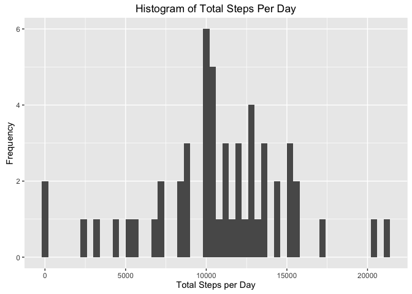
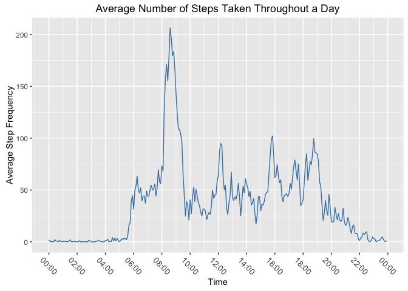
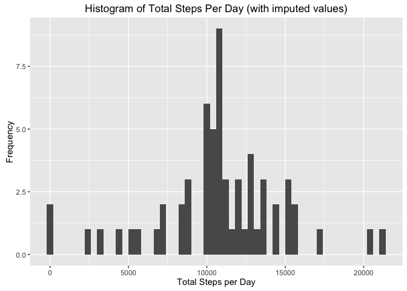
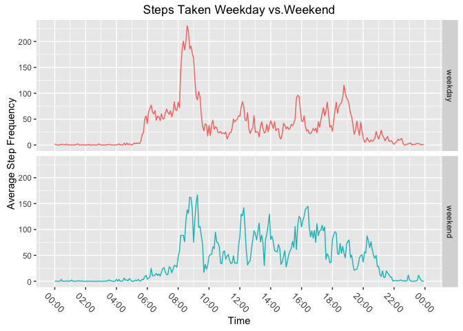

# Reproducible Research: Peer Assessment 1

First, We will remove all variables from the environment

```r
#removes all variables from environment
rm(list=ls(all=TRUE)) 
```

## Loading and preprocessing the data
Now we will load all required libarries


```r
 library(ggplot2)
 library(dplyr)
```

```
## 
## Attaching package: 'dplyr'
```

```
## The following objects are masked from 'package:stats':
## 
##     filter, lag
```

```
## The following objects are masked from 'package:base':
## 
##     intersect, setdiff, setequal, union
```

```r
 library(RColorBrewer)
 library(ggthemes)
 library(scales)
 library(lubridate)
```

```
## 
## Attaching package: 'lubridate'
```

```
## The following object is masked from 'package:base':
## 
##     date
```
Load CSV file from local directory

```r
 activity <- read.csv("activity.csv")
# Verify data for testing purpose only
 head(activity)
```

```
##   steps       date interval
## 1    NA 2012-10-01        0
## 2    NA 2012-10-01        5
## 3    NA 2012-10-01       10
## 4    NA 2012-10-01       15
## 5    NA 2012-10-01       20
## 6    NA 2012-10-01       25
```
## What is mean total number of steps taken per day?

```r
totalSteps<- aggregate(steps ~ date, activity, sum)
#check aggregated data
head(totalSteps)
```

```
##         date steps
## 1 2012-10-02   126
## 2 2012-10-03 11352
## 3 2012-10-04 12116
## 4 2012-10-05 13294
## 5 2012-10-06 15420
## 6 2012-10-07 11015
```

```r
#plot 
qplot(totalSteps$steps, main = "Histogram of Total Steps Per Day", xlab = 'Total Steps per Day', ylab = "Frequency", binwidth = 400)
```

<!-- -->

```r
#calculate mean and median
mean(totalSteps$steps, na.rm = TRUE)
```

```
## [1] 10766.19
```

```r
median(totalSteps$steps, na.rm = TRUE)
```

```
## [1] 10765
```
## What is the average daily activity pattern?


```r
activity$Interval <- as.POSIXct(strptime(sprintf("%04d", activity$interval), "%H%M"))
avgSteps <- aggregate(x=list(steps=activity$steps), by=list(interval=activity$Interval), FUN = mean, na.rm=TRUE)
ggplot(data = avgSteps, aes(x=interval, y=steps)) + 
    geom_line(color = "steelblue") +
    theme(axis.text.x=element_text(angle = 315,
                                    hjust = 0.5,
                                   vjust = 0.5,
                                    size = 10))+
    ggtitle("Average Number of Steps Taken Throughout a Day") +
    scale_x_datetime(breaks = date_breaks("2 hour"),
                     labels = date_format("%H:%M", tz = "")) +
    xlab("Time")+
    ylab("Average Step Frequency")
```

<!-- -->

```r
avgSteps[which.max(avgSteps$steps),]
```

```
##                interval    steps
## 104 2016-11-04 08:35:00 206.1698
```

```r
sum(is.na(activity$steps))
```

```
## [1] 2304
```
## Imputing missing values

```r
fillNA <- activity %>%
    group_by(Interval) %>%
     summarise(avg_steps = mean(steps, na.rm = TRUE)) %>%
     merge(activity, .) %>%
     mutate(steps = ifelse(is.na(steps)==TRUE, avg_steps, steps)) %>%
     select(-avg_steps)

sum(is.na(fillNA$steps))
```

```
## [1] 0
```

```r
sum(is.na(fillNA$steps))
```

```
## [1] 0
```

```r
totalfillNA <- aggregate(x = list(steps = fillNA$steps) , 
                           by = list(date= fillNA$date),
                          FUN = sum, na.rm=TRUE)
 head(totalfillNA)
```

```
##         date    steps
## 1 2012-10-01 10766.19
## 2 2012-10-02   126.00
## 3 2012-10-03 11352.00
## 4 2012-10-04 12116.00
## 5 2012-10-05 13294.00
## 6 2012-10-06 15420.00
```

```r
 qplot(totalfillNA$steps,
       main = "Histogram of Total Steps Per Day (with imputed values)",
       xlab = 'Total Steps per Day', 
       ylab = "Frequency", 
       binwidth = 400)
```

<!-- -->

```r
 mean(totalfillNA$steps)
```

```
## [1] 10766.19
```

```r
median(totalfillNA$steps)
```

```
## [1] 10766.19
```

```r
 daytype.function <- function(X) {
     daytype <- weekdays(X)
     if (daytype %in% c("Saturday", "Sunday"))
         return("weekend")
     else if (daytype %in% c("Monday", "Tuesday", "Wednesday", "Thursday", "Friday"))
         return("weekday")
 }
 finalData <- fillNA
 finalData$date <- as.Date(finalData$date)
 finalData$daytype <- sapply(finalData$date, FUN = daytype.function)
 head(finalData)
```

```
##     Interval    steps       date interval daytype
## 1 2016-11-04 1.716981 2012-10-01        0 weekday
## 2 2016-11-04 0.000000 2012-11-23        0 weekday
## 3 2016-11-04 0.000000 2012-10-28        0 weekend
## 4 2016-11-04 0.000000 2012-11-06        0 weekday
## 5 2016-11-04 0.000000 2012-11-24        0 weekend
## 6 2016-11-04 0.000000 2012-11-15        0 weekday
```

## Are there differences in activity patterns between weekdays and weekends?
 
 ```r
 lastPlot <- aggregate(steps ~ Interval + daytype, data = finalData, mean)
 ggplot(lastPlot, aes(x= Interval, y= steps, colour = daytype)) +
     geom_line() +
     facet_grid(daytype ~ .) +
     theme(legend.position="none", 
           axis.text.x=element_text(angle = 315,
                                    hjust = 0.5,
                                    vjust = 0.5,
                                    size = 10)) + 
     ggtitle("Steps Taken Weekday vs.Weekend") +
     scale_x_datetime(breaks = date_breaks("2 hour"),
                      labels = date_format("%H:%M", tz = "")) +
    xlab("Time")+
    ylab("Average Step Frequency")
 ```
 
 <!-- -->
